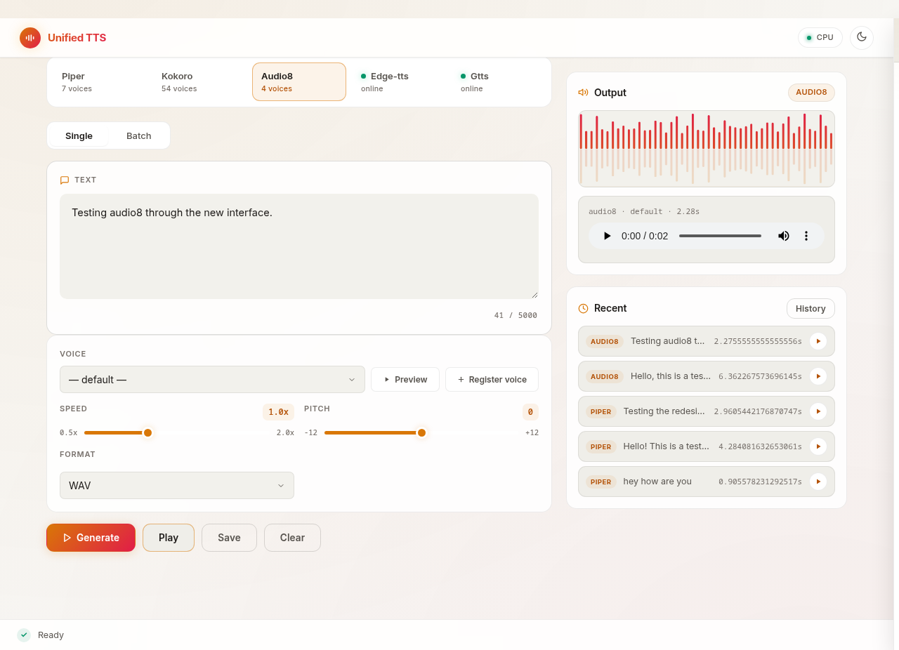

# Unified TTS

A single web UI for multiple text-to-speech engines. Synthesis runs
server-side in Python/FastAPI; the browser is a thin client that only sends
text and plays back audio. Engines are pluggable — local ONNX models and
online services coexist behind one interface.




## Features

- **One UI, many engines** — engine tabs are generated from a registry; the
  frontend never hardcodes engines.
- **Per-engine parameter auto-detection** — each engine declares a parameter
  schema (sliders, selects, defaults, ranges) that the UI renders dynamically.
- **Hardware capability detection** — `/api/device` reports CPU/RAM/GPU and
  tells you whether a local engine can run on your machine before you
  download gigabytes of weights.
- **Built-in model downloader** — a **Models** dialog lists every downloadable
  model with its install state, size, and per-model download buttons. Piper
  voices, Kokoro, and the full Audio8 INT4 snapshot download from HuggingFace
  in the background with live progress, no CLI or API token needed. New
  engines' models appear in the dialog automatically.
- **Voice registration** — for voice-cloning-capable engines (Audio8), record
  a short reference clip in the browser and register it as a named voice.
- **Batch mode, history, and export** — generate multiple lines at once,
  browse past generations, download WAV/MP3/FLAC or a ZIP of everything.

## Supported engines

| ID | Type | Model | Size | Notes |
|---|---|---|---|---|
| `kitten-tts` | Local ONNX | [KittenML/kitten-tts-mini-0.8](https://huggingface.co/KittenML/kitten-tts-mini-0.8) | ~80 MB | 8 voices, ultra-lightweight, CPU-only |
| `piper` | Local ONNX | [rhasspy/piper-voices](https://huggingface.co/rhasspy/piper-voices) | ~300 MB | 100+ voices |
| `kokoro` | Local ONNX | [hexgrad/kokoro](https://huggingface.co/hexgrad/kokoro) | ~900 MB | 2nd-gen, needs espeak-ng |
| `audio8` | Daemon ONNX INT4 | [Audio8 0.6B](https://huggingface.co/Audio8/Audio8-TTS-Preview-0.6B-ONNX-INT4) | ~1.6 GB | voice cloning, 900-char/request |
| `edge-tts` | Online (Microsoft) | — | 0 | free, needs internet |
| `gtts` | Online (Google) | — | 0 | free, needs internet |

Local engines download their models on first use through the UI
(Models → Download). Online engines work immediately.

## Requirements

- Linux (Fedora/Ubuntu/Debian tested), **Python 3.10+**
- **~4 GB free RAM** if you plan to run all three local engines at once
  (~2.5 GB for just Piper + Kokoro)
- **~2 GB free disk** for the Audio8 INT4 weights (plus a few hundred MB per other local engine)

**System packages** (only needed for local engines — online engines
work without these):

| Package | Purpose | Install |
|---|---|---|
| `espeak-ng` | Required by the Kokoro engine | `sudo apt install espeak-ng` (Debian/Ubuntu) · `sudo dnf install espeak-ng` (Fedora) |
| `ffmpeg` | Required for MP3 export via pydub | `sudo apt install ffmpeg` (Debian/Ubuntu) · `sudo dnf install ffmpeg` (Fedora) |

## Quick start

**Minimal install** — web UI + online engines only (edge-tts, gtts), no
local models, no librosa/numba dependency (~150 MB pip cache):

```bash
git clone https://github.com/manojkumar9121/unified-tts && cd unified-tts
python3 -m venv .venv && source .venv/bin/activate
pip install -r requirements.txt[core]
bash run.sh
```

**Full install** — all engines including local ONNX models:

```bash
git clone https://github.com/manojkumar9121/unified-tts && cd unified-tts
python3 -m venv .venv && source .venv/bin/activate
pip install -r requirements.txt        # everything, or pick extras below
bash run.sh
```

**Check dependencies before starting:**

```bash
python3 check_deps.py                  # full check
python3 check_deps.py --core           # minimal check only
```

Open http://localhost:8000. The first time you use a local engine, hit
**Models → Download** for it and wait for the progress bar.

Optional: for GPU capability reporting install CPU-only torch
(uncomment `torch` in `requirements.txt`); all engines run fine without it.

### Lightweight install options

| Install command | What you get | pip cache size |
|---|---|---|
| `pip install -r requirements.txt[core]` | Web UI + edge-tts + gtts | ~150 MB |
| `pip install -r requirements.txt[local]` | + Piper, Kokoro, Audio8 (needs espeak-ng) | ~900 MB |
| `pip install -r requirements.txt[online]` | + edge-tts, gTTS | ~100 MB |
| `pip install -r requirements.txt[audio]` | MP3/FLAC export (needs ffmpeg) | ~50 MB |
| `pip install -r requirements.txt` | Everything | ~1.2 GB |

## How it works

```
Browser (static/) ──▶ FastAPI (server.py)
                        │  engine registry (tts_engine.py)
                        ├── Piper   ── in-process ONNX
                        ├── Kokoro  ── in-process ONNX
                        ├── Audio8  ── daemon subprocess (audio8_repo/, :8024)
                        ├── edge-tts ── HTTPS
                        └── gtts     ── HTTPS
                        │
                        └── HuggingFace (model_downloader.py, background)
```

- **Audio8 daemon**: `server.py` manages a separate FastAPI daemon on port
  8024 that loads the 1.6 GB model once and keeps it warm. The daemon
  survives server restarts (it is adopted, not restarted) because a cold
  reload costs 60–90 seconds. Stop it manually with
  `POST /api/runtime/unload`.
- **Auto-unload**: local engines unload after 5 minutes idle
  (`TTS_UNLOAD_IDLE_SECONDS`). The Audio8 daemon is exempt — restarting it
  is expensive, and it is a separate process.

## Configuration (environment variables)

| Variable | Default | Meaning |
|---|---|---|
| `TTS_UNLOAD_IDLE_SECONDS` | `300` | Idle time before local models unload |
| `AUDIO8_PORT` | `8024` | Port for the Audio8 daemon |
| `ARKTTS_MODEL_DIR` | `audio8_models/` | Audio8 weights location |
| `ARKTTS_VOICES_DIR` | `audio8_voices/` | Registered Audio8 voices |
| `ARKTTS_PRECISION` | `int4` | Audio8 quantization |
| `ARKTTS_CODEC_PRECISION` | `fp16` | Audio8 codec quantization |
| `ARKTTS_THREADS` | `5` | Audio8 inference threads |

## API

| Endpoint | Purpose |
|---|---|
| `GET /api/engines` | Engine list + parameter schemas |
| `GET /api/voices?engine_id=...` | Voice list for an engine |
| `POST /api/generate` | Synthesize `{engine_id, text, voice, speed, pitch, params...}` |
| `POST /api/voices/register` | Register an Audio8 voice (multipart: audio + transcript + name) |
| `GET /api/device` | Hardware + per-engine capability report |
| `GET /api/models/download/status` | Model download progress |
| `POST /api/models/download` | Start a model download |
| `POST /api/runtime/unload` | Unload engines / stop the Audio8 daemon |
| `GET /output/{file}` | Fetch generated audio |

## Adding a new engine

Engines are discovered at startup from a decorator registry — no frontend
changes needed. In `tts_engine.py`:

```python
@register_engine("my-engine")
class MyEngine(TTSEngine):
    is_online = False              # True for cloud services
    is_downloadable = True         # model can be fetched by the downloader
    native_speed = False           # True if the engine takes speed natively
    max_text_chars = 5000

    engine_params = {              # rendered as sliders/selects in the UI
        "speed": {"type": "float", "default": 1.0, "min": 0.5, "max": 2.0,
                  "step": 0.05, "label": "Speed", "group": "main"},
    }

    def list_voices(self) -> list[str]: ...
    def synthesize(self, text, voice, **params) -> tuple[np.ndarray, int]: ...
```

If your model downloads from HuggingFace, add a spec to `model_downloader.py`
and the existing progress-tracked pipeline handles it.

## Project layout

| Path | Role |
|---|---|
| `server.py` | FastAPI app: routes, UI, downloads, hardware detection |
| `tts_engine.py` | Engine abstraction + all engine implementations |
| `audio8_manager.py` | Subprocess lifecycle for the Audio8 daemon |
| `model_downloader.py` | Background HuggingFace downloader (stdlib only) |
| `audio8_repo/` | Vendored Audio8 ONNX runtime daemon (Apache-2.0, see NOTICE.md) |
| `static/` + `templates/` | Web UI (vanilla JS, no build step) |
| `models/`, `audio8_models/`, `audio8_voices/`, `output/`, `data/` | Runtime data (gitignored) |

## Acknowledgements

This project was developed with the help of AI coding assistants — primarily
[KAT 2.5 dev](https://github.com/KatAi-Corp/Kat) and DeepSeek v4 Flash. Most of
the architecture, engine implementations, and the web UI were produced through
collaborative pair-programming with these models, with KAT 2.5 dev doing the
majority of the heavy lifting.

## License

MIT (see `LICENSE`). Note that `audio8_repo/` and the model weights it runs
are Apache-2.0 (see `NOTICE.md` for attribution); downloaded models carry
their own licenses.
